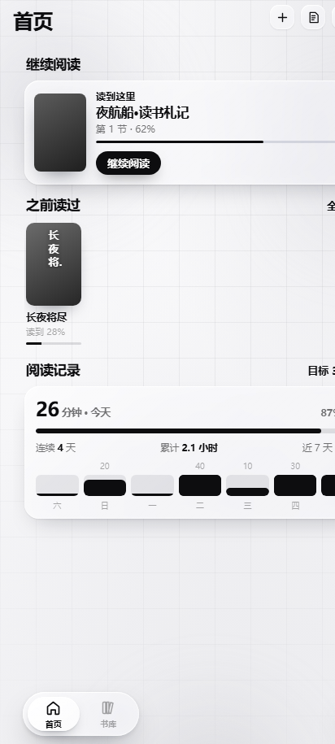
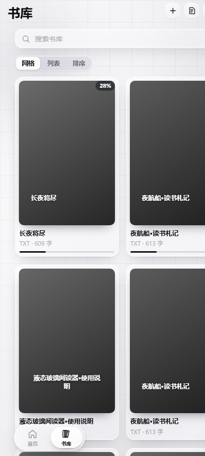
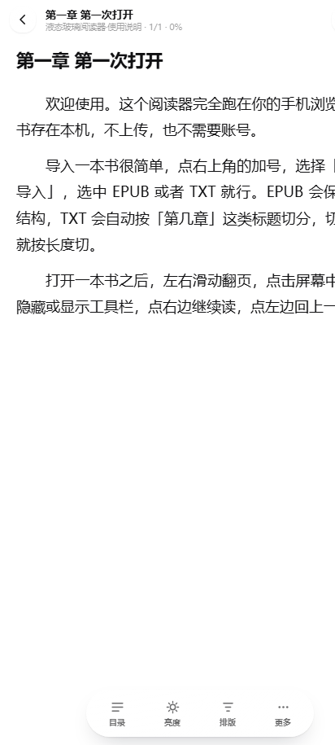
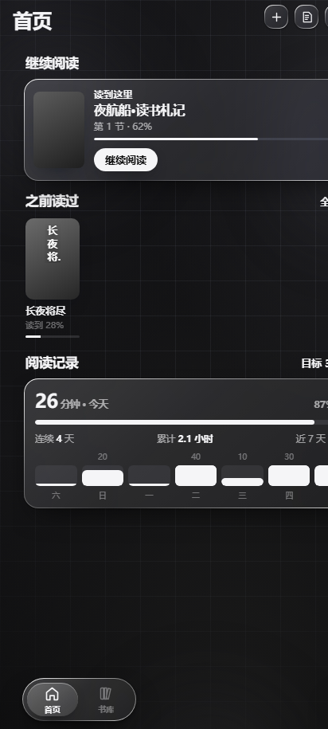
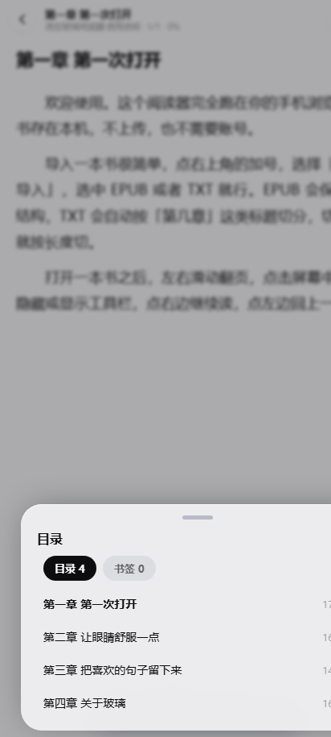
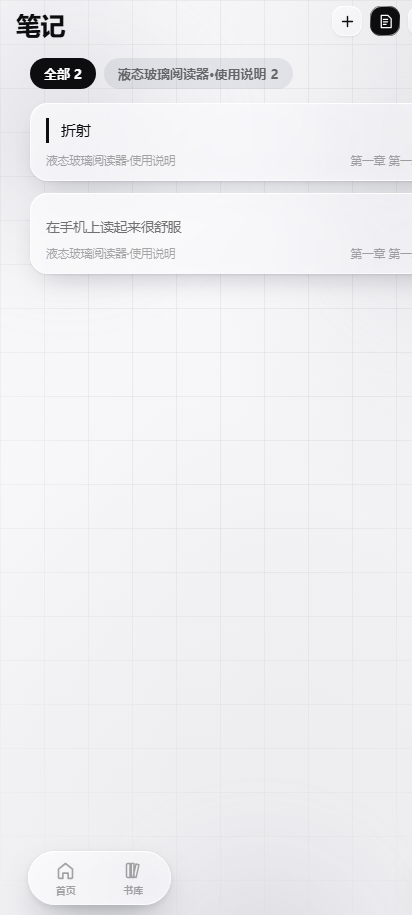
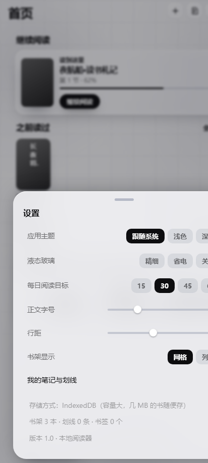

# 茉阅 · MoRead

一个**纯本地、离线**的安卓小说阅读器。黑白两色、毛玻璃 + 液态玻璃质感，所有数据只存在你自己的手机上。



## 它长什么样

| 书库 | 阅读 | 深色 |
| --- | --- | --- |
|  |  |  |

| 目录 | 笔记 | 设置 |
| --- | --- | --- |
|  |  |  |

更多截图在 [`docs/screenshots/`](docs/screenshots/)（共 22 张，含排版面板、翻页方式、亮度、搜索、登录等）。

## 功能

- **导入**：TXT / EPUB，也可以直接粘贴文本。TXT 会按「第几章」这类标题自动切分，切不出来就按长度切。
- **阅读**：分栏分页、三种翻页方式（平移 / 滑动 / 仿真纸张）、上下连读、字号行距页边距、双栏、
  深/浅/纯黑纸色、亮度、单手模式、音量键翻页、左右滑动翻页。
- **记录**：自动记住每本书读到哪一页（存的是字符偏移，所以改字号、改行距之后落的还是同一句话）；
  阅读时长统计与 7 天柱状图；阅读目标。
- **笔记**：划线圈选、写想法、书签、书内搜索，全部汇总到「我的笔记与划线」。
- **界面**：首页三块（继续阅读 / 之前读过 / 阅读记录），书库网格与列表（可左右滑动切换），
  独立搜索页，全部跟随系统深浅色。

## 技术特点

**形态是「网页应用 + 零依赖安卓壳」**：`app/` 里是一个纯 HTML/CSS/JS 的阅读器，
`android/` 里是一个只负责装 WebView、处理返回键 / 音量键 / 沉浸模式 / 导入文件的壳。
没有 Gradle 依赖、没有 npm 依赖，`android/build-apk.ps1` 用 aapt2 + ecj + d8 直接出包。

**液态玻璃**是这套东西里最花功夫的部分，做法在 [`docs/DEVELOPMENT.md`](docs/DEVELOPMENT.md) 里有完整记录：

- 折射用位移贴图：按圆角矩形的**有符号距离场**算梯度，只在贴边的窄带里按四分之一圆衰减地掰弯背后的像素
  （剖面与梯度写法参考 [Kyant0/AndroidLiquidGlass](https://github.com/Kyant0/AndroidLiquidGlass)）；
- 边光是「上亮下暗」的一道 1px 渐变 + 底边内阴影 —— 白底上的玻璃只能靠这个立起来，靠折射不行
  （背后是纯色时，折射对纯色的位移是恒等变换，实测 8 倍强度也是 0 像素变化）。

**粒子动画**（开书重聚 / 关书化灰 / 删除书籍与划线、导入书籍）都不是逐颗 `save/rotate/drawImage`，
而是把花瓣轮廓按角度算好控制点、攒进一条路径整组一次 `fill`；整页效果按透明度分 5 档批处理。
真机实测平均 8.5~9.4ms 一帧。

## 下载安装

到 [Releases](../../releases/latest) 下载 `moyue.apk`，直接安装即可。

**签名固定**，以后覆盖安装不会丢书、笔记和阅读进度。装好之后可以用应用内的
「设置 → 软件更新」检查新版本（填 `update.json` 的地址，见下）。

## 软件更新

应用内的「设置 → 软件更新」支持联网检查：填一个 `update.json` 的地址，格式是

```json
{ "build": "2026-10-04 16:00", "apk": "https://…/moyue.apk", "notes": "改了什么" }
```

`build` 与应用的构建时间直接比字符串大小（都是 `YYYY-MM-DD HH:MM`），比当前新就会出现「下载并安装」。
本仓库根目录的 [`update.json`](update.json) 就是给这个用的。

## 隐私

- 书、笔记、进度全部存在**本机**（IndexedDB），没有任何账号服务器、不上传任何内容。
- 应用只声明两个权限：`INTERNET`（WebView 加载本地资源用的虚拟域名 + 联网检查更新）和
  `REQUEST_INSTALL_PACKAGES`（自我更新时把 APK 交给系统安装器）。
- 导入书籍走系统文件选择器（SAF），**不需要任何存储权限**。
- 登录功能是**本地**的：邮箱 + 密码只在这台设备上做加盐散列保存，没有注册接口。

## 许可

[MIT](LICENSE)。液态玻璃的折射公式参考了 [Kyant0/AndroidLiquidGlass](https://github.com/Kyant0/AndroidLiquidGlass)（Apache-2.0），
排版设置项与取值范围对齐 [Readest](https://github.com/readest/readest) 的设计。

本仓库只发布安装包，不提供源代码。
